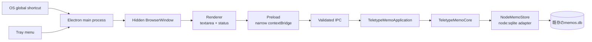
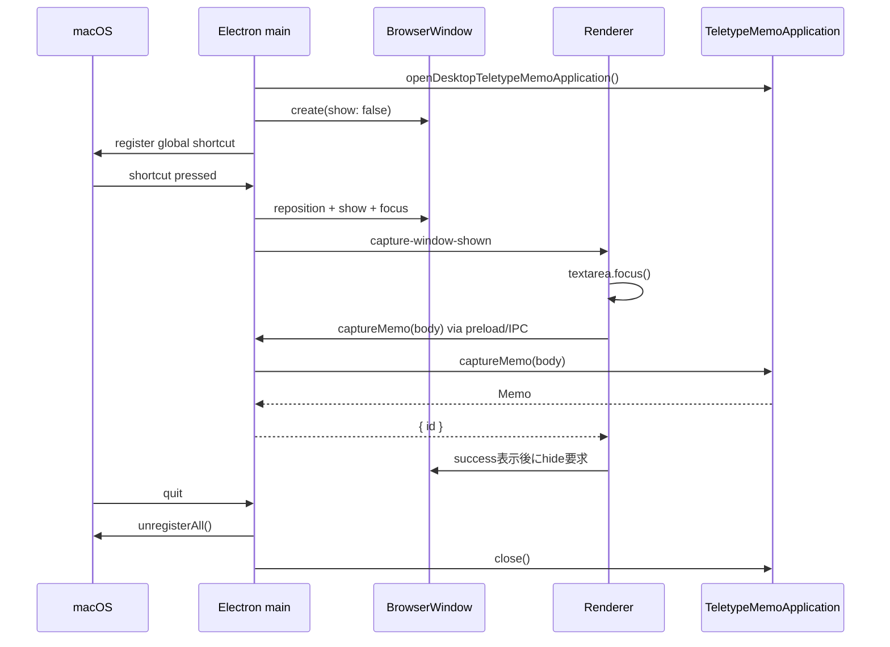

# Teletype Memo Desktop MVP 設計

## 1. この文書の位置づけ

この文書は、Teletype Memoへ常駐デスクトップ入力UIを追加するための技術判断と、最初の実装範囲を定める。

最初からCLIの全機能を移植するのではなく、次の価値だけを最短で検証する。

> どのアプリで作業していても、グローバルショートカットから小さな入力窓を呼び出し、思考を止めずに追記専用メモを保存できる。

## 2. MVPの範囲

### 2.1 実装する

- macOSで常駐する。
- グローバルショートカットで入力窓を表示する。
- 既存の`TeletypeMemoApplication.captureMemo()`を経由して同じSQLiteへ保存する。
- 保存成功後に入力を消し、短い成功表示の後でウィンドウを隠す。
- Escapeまたはフォーカス喪失でウィンドウを隠す。
- Trayメニューから入力窓を開く、またはアプリを終了できる。

### 2.2 実装しない

- 保存済みメモの一覧、検索、表示、編集、削除
- AI下書き生成、レビュー、Notion公開
- ログイン時の自動起動
- ショートカット変更画面
- Windows、Linux向け配布
- 自動更新、コード署名、notarization

これらはApplication APIを通じて後から追加できるが、最初の価値検証には含めない。

## 3. 技術選定

### 3.1 結論

最初のDesktop MVPには**Electron 44系**を使う。UIはローカルHTML、CSS、TypeScriptで作り、ReactなどのUI frameworkはまだ導入しない。

Electronを永続的な最終選択とはみなさない。入力体験とApplication APIの境界を検証するための、現時点で最も確実な実装手段として採用する。

### 3.2 比較

| 候補 | グローバルショートカット | 既存Bunコード | 追加される学習対象 | 判断 |
| --- | --- | --- | --- | --- |
| Electron | 公式`globalShortcut` APIがある | Coreは再利用でき、Bun固有adapterだけNode版が必要 | main/preload/renderer、IPC | MVPに採用 |
| Tauri 2 | 公式pluginがある | Bunをsidecar化し、RustとのIPCが必要 | Rust、権限設定、sidecar lifecycle | 今回は複雑すぎる |
| Electrobun 2 | 実Bunをmain processに選べる | 最も再利用しやすい | 新しいbuild/runtime model | 必須のsystem-wide shortcut APIを公式資料で確認できず保留 |

判断根拠となる公式資料：

- Electronの[`globalShortcut`](https://www.electronjs.org/docs/latest/api/global-shortcut/)は、アプリにフォーカスがない状態のキー入力を扱える。
- Electronの[`BrowserWindow`](https://www.electronjs.org/docs/latest/api/browser-window)は、非表示で事前生成し、表示・フォーカス・always-on-topを制御できる。
- Electronの[`Tray`](https://www.electronjs.org/docs/latest/api/tray/)は、常駐アプリの入口と終了メニューを提供できる。
- Electron 44はNode 24を同梱する。[Electron release schedule](https://releases.electronjs.org/schedule)を参照する。
- Nodeの[`node:sqlite`](https://nodejs.org/api/sqlite.html)は同期SQLite APIを提供する。ただし安定度はまだrelease candidateなので、Bun版との互換テストを必須にする。
- Tauriの[Global Shortcut plugin](https://v2.tauri.app/plugin/global-shortcut/)は要件を満たすが、既存JavaScriptを使う場合は[sidecar](https://v2.tauri.app/learn/sidecar-nodejs/)とのプロセス間通信が必要になる。
- Electrobunは[実Bunをmain processとして選択できる](https://framework.blackboard.sh/electrobun/guides/native-main-process/)ため将来の有力候補である。

### 3.3 Electronを選ぶ代償

- ChromiumとNodeを同梱するため、アプリサイズとメモリ使用量は小さなnative shellより大きい。
- 現在の`bun:sqlite`をElectron main processから利用できない。
- `Bun.spawn`を使うKeychainとブラウザ起動adapterは、そのままElectronでは実行できない。

Desktop MVPではメモ保存だけを有効にする。`MemoRepository`のNode版を追加し、AI・NotionのNode adapterは実際にデスクトップUIへ載せる段階で実装する。

## 4. プロセス構成



### 4.1 Electron main process

main processだけが次の権限を持つ。

- `TeletypeMemoApplication`の生成と終了
- SQLiteアクセス
- グローバルショートカット登録
- BrowserWindowの表示・非表示・位置調整
- Trayと終了処理
- IPC引数の検証

### 4.2 Preload

preloadは`contextBridge`から次の狭いAPIだけをrendererへ公開する。

```ts
interface TeletypeMemoDesktopApi {
  captureMemo(body: string): Promise<{ id: number }>;
  hideCaptureWindow(): Promise<void>;
  onCaptureWindowShown(listener: () => void): () => void;
}
```

`ipcRenderer`そのもの、ファイルシステム、shell、Applicationオブジェクトは公開しない。

### 4.3 Renderer

rendererは表示と入力だけを担当する。

- ローカルに同梱したHTML、CSS、JavaScriptだけを読み込む。
- textarea、保存中表示、成功・失敗表示を持つ。
- SQLite、Electron main API、Gemini、Notionへ直接アクセスしない。

Electronの[Security Checklist](https://www.electronjs.org/docs/latest/tutorial/security)に従い、`nodeIntegration: false`、`contextIsolation: true`、sandbox有効、制限したCSPを使う。preloadでは[`contextBridge`](https://www.electronjs.org/docs/latest/api/context-bridge)から個別関数だけを公開する。

## 5. 入力体験

### 5.1 表示

- 初回起動時に約600×240pxのBrowserWindowを`show: false`で1つ作る。
- `frame: false`、`resizable: false`、`alwaysOnTop: true`、`skipTaskbar: true`とする。
- ショートカットの初期値は`CommandOrControl+Shift+M`とする。
- 呼び出し時はマウスカーソルがあるdisplayの中央付近へ移動し、表示してtextareaへフォーカスする。
- ウィンドウは保存のたびに破棄せず、隠して再利用する。

### 5.2 入力と確定

- 通常のEnterは改行する。
- 現在行が空の状態でさらにEnterを押すと保存する。CLIと同じ操作モデルである。
- 日本語IME変換中のEnterでは保存判定しない。DOM eventの`isComposing`を確認する。
- Escapeは保存せずウィンドウを隠す。
- Escapeで隠した未保存文字列は、アプリ終了まではrendererメモリに残し、次回表示時に復元する。
- 保存中は二重送信を禁止する。

### 5.3 成功と失敗

- 成功時は`Saved #<id>`を短時間表示する。
- 成功を確認してから入力を空にし、ウィンドウを隠す。
- 失敗時はウィンドウと入力を残し、エラーを表示して再試行可能にする。
- rendererが成功表示を終える前にクラッシュしても、main processから成功応答が返っていればSQLite保存は完了している。

## 6. Application APIとの接続

既存の次のコードはそのまま共有する。

- `TeletypeMemoApplication`
- `TeletypeMemoCore`
- `MemoRepository`、`Memo`などのドメイン型
- append-only制約と入力検証

Electron用に次を追加する。

```text
NodeMemoStore implements MemoRepository
openDesktopTeletypeMemoApplication()
```

`openDesktopTeletypeMemoApplication()`はBun版`openTeletypeMemoApplication()`をimportしない。Electron main processで利用できるNode adapterを注入し、同じApplicationクラスを組み立てる。

Node版StoreはBun版と同じschema、SQL、日時形式を使う。CLIとDesktopが同じDBを安全に開けることを、実ファイルを使った互換テストで保証する。WALに加えてbusy timeoutを設定し、短時間の同時書き込みを待てるようにする。

## 7. アプリケーションのライフサイクル



ウィンドウのclose操作は通常はhideへ変換する。TrayのQuitまたは`Command+Q`だけがプロセスを終了し、終了時にショートカット解除とApplicationの`close()`を行う。

ショートカット登録は競合時に失敗し得るため、戻り値を検査する。失敗してもアプリ全体を落とさず、Trayの「New Memo」からは開ける状態にする。

## 8. 実装ステップ

### Step 1：Desktop shell spike

- Electron 44を開発依存へ追加する。
- 非表示BrowserWindowとローカルHTMLを作る。
- global shortcutとTrayから表示できるようにする。
- Escapeとblurでhideする。
- まだSQLiteへ保存しない。

この段階では「別アプリを使用中に呼び出せるか」「表示が十分速いか」だけを確認する。

### Step 2：保存bridge

- `NodeMemoStore`を実装する。
- Bun版Storeと同じRepository contract testを通す。
- `openDesktopTeletypeMemoApplication()`を追加する。
- preload、IPC、rendererから`captureMemo()`を呼ぶ。
- CLIとDesktopで同じ一時DBを読み書きする互換テストを追加する。

### Step 3：入力UX

- 空行Enter、IME、二重送信、Escape、blurを実装する。
- 成功・失敗表示と未保存buffer保持を追加する。
- キーボード中心のrendererテストを追加する。

### Step 4：配布準備

- Electron Forgeを導入する。Electron公式も[packagingにForgeを推奨](https://www.electronjs.org/docs/latest/tutorial/application-distribution)している。
- `.app`を作り、実機で起動・Tray・shortcut・DBパスを確認する。
- アイコン、署名、notarization、自動起動は価値検証後に扱う。

## 9. Desktop MVPの受け入れ条件

- 他アプリにフォーカス中でもショートカットで入力窓を表示できる。
- 表示後すぐにキーボード入力できる。
- 複数行を入力し、空行Enterで1件だけ保存できる。
- 日本語IMEの確定Enterで誤保存しない。
- 保存結果をCLIの`memo show <id>`で読める。
- DesktopとCLIの同時利用でDB破損や即時lock errorが起きない。
- Escapeでは保存されず、再表示すると未保存文字列が残る。
- 保存失敗時に入力文字列が失われない。
- rendererからNode/Electron APIへ直接アクセスできない。
- アプリ終了時にDBとglobal shortcutを解放する。

## 10. 再評価条件

次のいずれかが起きた場合、ElectrobunまたはTauriを再評価する。

- Electronの常駐メモリまたは配布サイズが利用体験上の問題になる。
- Electrobunにsystem-wide global shortcutの安定した公式APIが追加される。
- Node adapterの維持コストがBun sidecarより高くなる。
- native UIやmacOS固有の入力体験がWebViewでは実現しにくくなる。

この再評価でも、rendererから直接DBへ触れずApplication APIを境界にする方針は維持する。
