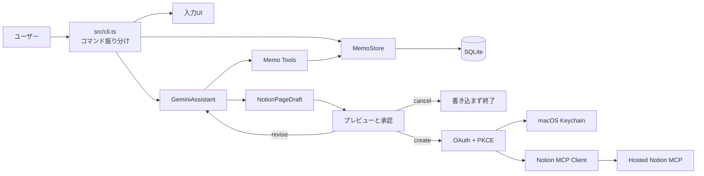
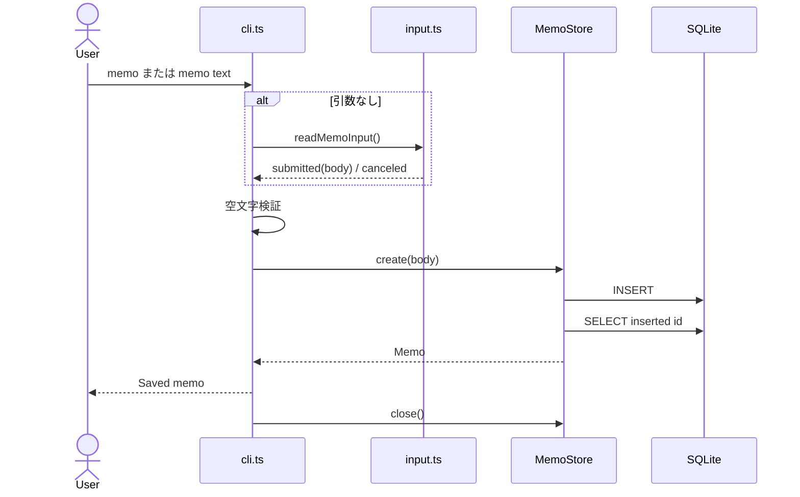
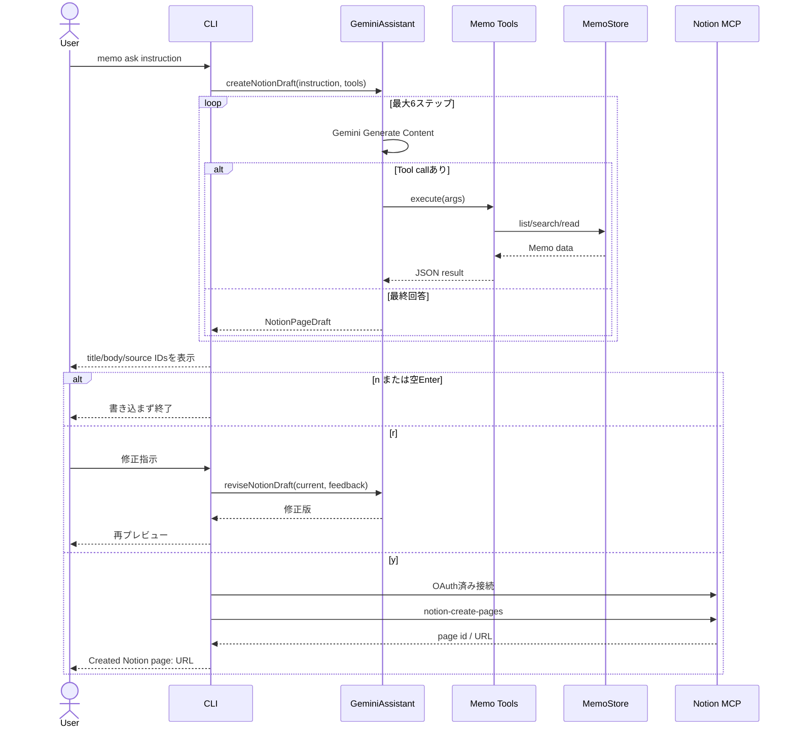
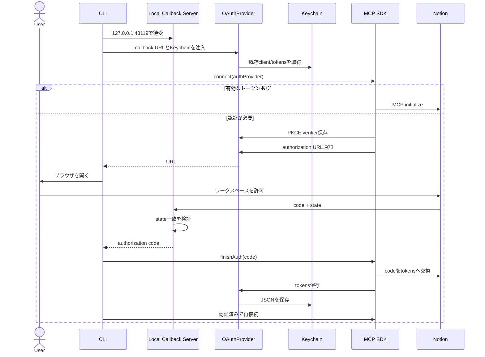

# Teletype Memo 詳細設計書

## 1. この文書の目的

この文書は、Teletype Memoの現在のコードを学習目的で理解するための詳細設計書である。

対象は、リポジトリに含まれるアプリケーションコード、テスト、設定ファイル、生成ファイルである。プロダクトとして何を作るかは[PRD](./PRD.md)、利用方法は[README](../README.md)を参照し、この文書では主に次を説明する。

- コマンドを入力してから処理が完了するまでの流れ
- 各ファイル、型、クラス、関数の責務
- SQLite、Gemini、Notion MCPの境界
- AIエージェントのTool実行ループ
- OAuth、PKCE、Keychainを使った認証
- Notionへ書き込む前の人間による承認
- テストが保証している範囲
- 現在の制約と未実装部分

この文書は`main`ブランチの現在の実装を基準にしている。

## 2. システムの全体像

Teletype Memoは、次の4つの領域から構成される。

1. **ローカル受信箱**：ターミナルからメモを受け取り、SQLiteへ保存する。
2. **AIエージェント**：Geminiがローカルメモ用Toolsを選択・実行し、Notionページ案を作る。
3. **人間による承認UI**：下書きをプレビューし、作成・修正・キャンセルを選ぶ。
4. **Notion連携**：OAuth認証済みのMCPクライアントとしてNotionページを作る。

現在の実装はCLIをフロントエンドにしているが、将来は保存・AI・MCP処理を共通Coreとして抽出し、同じCoreをデスクトップのグローバルショートカット入力UIから利用する。CLIは廃止せず、開発・デバッグ・自動化用フロントエンドとして残す。



### 2.1 重要な設計境界

- メモ保存はGeminiやNotionへ依存しない。
- Geminiに渡すToolsはローカルメモの読み取り専用である。
- Gemini自身にはNotion書き込みToolを渡さない。
- Notion MCPへ接続するのは、ユーザーがプレビュー後に`y`を選んだ場合だけである。
- `n`または空Enterでは、Notionへ接続せず元メモも変更しない。
- OAuthトークンはSQLiteや`.env`ではなくmacOS Keychainへ保存する。

## 3. 技術スタック

| 項目 | 採用技術 | 主な用途 |
| --- | --- | --- |
| ランタイム | Bun 1.3以降 | TypeScript実行、SQLite、テスト、子プロセス実行 |
| 言語 | TypeScript | アプリケーションとテスト |
| モジュール方式 | ES Modules | `type: module`、ESM import |
| ローカルDB | `bun:sqlite` | メモの永続化 |
| LLM SDK | `@google/genai` | Gemini Generate Content、Function Calling、構造化出力 |
| MCP SDK | `@modelcontextprotocol/sdk` | Streamable HTTP、OAuth、Tool一覧・Tool実行 |
| 外部連携 | Hosted Notion MCP | Notionワークスペースの読み書き |
| OAuth秘密情報 | macOS Keychain | クライアント登録情報、アクセストークン、リフレッシュトークン |
| テスト | `bun:test` | ユニットテストとlocalhost HTTPテスト |
| 型検査 | TypeScript `tsc --noEmit` | strictモードの静的検査 |

## 4. ディレクトリと全ファイルの役割

### 4.1 ルート

| ファイル | 役割 |
| --- | --- |
| [README.md](../README.md) | セットアップ、基本コマンド、利用者向け説明 |
| [docs/PRD.md](./PRD.md) | プロダクト価値、MVP要件、受け入れ条件、開発フェーズ |
| `docs/DETAILED_DESIGN.md` | 現在のコードを説明する本書 |
| [package.json](../package.json) | パッケージ情報、`memo`のbin、スクリプト、依存関係 |
| `bun.lock` | Bunが生成する依存バージョン固定ファイル。手動編集しない |
| [tsconfig.json](../tsconfig.json) | TypeScriptのESNext、strict、Bun/Node型設定 |
| `.env.example` | Gemini用環境変数の雛形。秘密値は含めない |
| `.env` | ローカルの実APIキー。Git対象外であり、内容を共有しない |
| `.gitignore` | `node_modules`、`.env`、SQLite本体・WAL、`.DS_Store`を除外 |
| `node_modules/` | Bunが生成する依存パッケージ。設計・Git管理対象外 |
| `.DS_Store` | macOS生成ファイル。Git管理対象外 |

### 4.2 アプリケーションコード

| ファイル | 責務 |
| --- | --- |
| [src/cli.ts](../src/cli.ts) | 唯一のCLIエントリーポイント。コマンド振り分けとユースケース調整 |
| [src/appMetadata.ts](../src/appMetadata.ts) | 表示名、互換性用内部ID、バージョン、help本文 |
| [src/config.ts](../src/config.ts) | SQLiteファイルの保存パス決定 |
| [src/store.ts](../src/store.ts) | SQLiteスキーマとメモCRUDの読み書き |
| [src/input.ts](../src/input.ts) | 空行で確定する複数行メモ入力 |
| [src/select.ts](../src/select.ts) | `memo show`のTTYキー選択UI |
| [src/gemini.ts](../src/gemini.ts) | Gemini接続、Toolループ、構造化下書き、修正、タイムアウト、リトライ |
| [src/tools/types.ts](../src/tools/types.ts) | LLMへ公開するToolの共通インターフェース |
| [src/tools/memoTools.ts](../src/tools/memoTools.ts) | `listMemos`、`searchMemos`、`readMemo`の実装 |
| [src/notion/draft.ts](../src/notion/draft.ts) | Notion下書き型、JSON Schema、実行時検証、表示整形 |
| [src/notion/draftReview.ts](../src/notion/draftReview.ts) | `y/r/n`入力を内部アクションへ変換 |
| [src/notion/keychainSecretStore.ts](../src/notion/keychainSecretStore.ts) | macOS Keychainへの秘密情報保存・取得・削除 |
| [src/notion/oauthProvider.ts](../src/notion/oauthProvider.ts) | MCP SDK用`OAuthClientProvider`と秘密情報の統合 |
| [src/notion/oauthCallbackServer.ts](../src/notion/oauthCallbackServer.ts) | localhost OAuthコールバック受付とstate検証 |
| [src/notion/openUrl.ts](../src/notion/openUrl.ts) | macOSブラウザでOAuth URLを開く |
| [src/notion/mcpClient.ts](../src/notion/mcpClient.ts) | Notion MCP接続、認証完了、Tool実行、応答検証 |

### 4.3 テストコード

| ファイル | 対象 |
| --- | --- |
| [tests/store.test.ts](../tests/store.test.ts) | SQLite保存、取得、一覧、検索、日付範囲、入力拒否 |
| [tests/appMetadata.test.ts](../tests/appMetadata.test.ts) | 表示名と内部IDの分離、help本文 |
| [tests/input.test.ts](../tests/input.test.ts) | 複数行入力、空行確定、EOF |
| [tests/select.test.ts](../tests/select.test.ts) | 選択位置の移動と循環 |
| [tests/memoTools.test.ts](../tests/memoTools.test.ts) | 3つのMemo Toolsと引数検証 |
| [tests/gemini.test.ts](../tests/gemini.test.ts) | Gemini Toolループ、構造化出力、修正、上限、リトライ |
| [tests/notionDraft.test.ts](../tests/notionDraft.test.ts) | 下書きJSONの検証・正規化・プレビュー |
| [tests/draftReview.test.ts](../tests/draftReview.test.ts) | `y/r/n`と空Enterの解釈 |
| [tests/keychainSecretStore.test.ts](../tests/keychainSecretStore.test.ts) | Keychainコマンド引数と終了コード処理 |
| [tests/oauthProvider.test.ts](../tests/oauthProvider.test.ts) | OAuthメタデータ、秘密情報、PKCE verifier、無効化 |
| [tests/oauthCallbackServer.test.ts](../tests/oauthCallbackServer.test.ts) | code、state、拒否応答、404 |
| [tests/openUrl.test.ts](../tests/openUrl.test.ts) | ブラウザ起動成功・失敗 |
| [tests/notionMcpClient.test.ts](../tests/notionMcpClient.test.ts) | Tool一覧、identity、ページ作成、close、トークン検証 |

### 4.4 表示名と内部識別子

`src/appMetadata.ts`は、人に見せる名称と既存データ互換性のための識別子を分離する。

| 定数 | 値 | 用途 |
| --- | --- | --- |
| `PRODUCT_NAME` | `Teletype Memo` | help、Gemini system instruction、OAuth表示名、ブラウザ完了画面 |
| `INTERNAL_APP_ID` | `terminal-ai-memo` | SQLiteディレクトリ、Keychain service、MCP client名、User-Agent |
| `APP_VERSION` | `0.1.0` | `--version`、MCP client version、User-Agent |

内部IDを一度に変更すると、既存SQLiteとKeychain資格情報が新しいアプリから見えなくなる。そのため、プロダクト名だけを変更し、内部IDは移行機構を用意するまで維持する。

## 5. 実装済みコマンド

以下はPRDではなく、現在の`src/cli.ts`が実際に解釈するコマンドである。

| 入力 | 処理 |
| --- | --- |
| `memo` | 対話的な複数行入力を開始する |
| `memo <text...>` | 引数全体を空白で連結して一行メモとして保存する |
| `memo list` | 最近の20件を新しい順に表示する |
| `memo list --limit N` | 1〜100件の範囲で一覧表示する |
| `memo show` | 最近の10件からTTYキー操作で選んで全文表示する |
| `memo show ID` | 正の整数IDで全文表示する |
| `memo search QUERY` | 本文を大文字・小文字を区別せず部分一致検索する |
| `memo ask INSTRUCTION` | Geminiがメモを調査し、下書き・修正・承認・Notion作成を行う |
| `memo notion connect` | OAuth認証、ワークスペース確認、MCP Tool一覧表示を行う |
| `memo --help`、`memo -h` | 実装済みコマンドとオプションを表示する |
| `memo --version`、`memo -v` | `0.1.0`を表示する |

### 5.1 現在まだ実装されていないコマンド

PRDに記載されていても、次は`src/cli.ts`に未実装である。

- `memo notion status`
- `memo config`
- `memo export`、`memo config`、管理用の`memo purge --all`

注意点として、既知のコマンド・オプション以外の第1引数はコマンドエラーではなく一行メモとして保存される。

## 6. CLIの詳細設計

### 6.1 エントリーポイント

`src/cli.ts`先頭のshebangにより、Bunで直接実行できる。`package.json`の`bin.memo`もこのファイルを指す。

最下部で`main()`を呼び、すべての未処理例外を1か所で捕捉する。

```text
正常終了: 各コマンドがreturn
異常終了: Error: <message> をstderrへ出し、process.exitCode = 1
```

`process.exit()`を直接呼ばず`exitCode`を設定するため、`finally`やストリームの後始末を実行できる。

### 6.2 コマンド振り分け

`main()`は`process.argv.slice(2)`の先頭を順番に調べる。

```text
list → show → search → ask → notion → 通常メモ保存
```

各ユースケースは、自分で`MemoStore`を生成し、`try/finally`で必ず`close()`する。CLIは依存性注入コンテナを持たず、エントリーポイントで具体クラスを組み立てる単純な構造である。

### 6.3 メモ保存フロー



### 6.4 `memo ask`フロー



### 6.5 承認ループ

`askGemini()`は`while (true)`で同じ下書きをプレビューする。

| 入力 | `parseDraftReviewAction` | 結果 |
| --- | --- | --- |
| `y`、`yes` | `create` | MCPへ接続して作成 |
| `r`、`revise` | `revise` | 一行の修正指示をGeminiへ送る |
| `n`、`no`、`cancel`、空Enter | `cancel` | 何も書き込まず終了 |
| その他 | `invalid` | メッセージを出して同じ下書きを再表示 |
| Ctrl-C | `null` | キャンセルとして終了 |

修正時はMemo Toolsを再度渡さない。現在の下書きと参照IDをJSONでGeminiへ渡し、ユーザーの修正指示だけを適用する。これにより、メモの再検索を避ける。

## 7. ローカルメモ層

### 7.1 DBパス決定

`src/config.ts`の`getDatabasePath()`は次の優先順位でパスを決める。

1. `TERMINAL_AI_MEMO_DB_PATH`
2. `XDG_DATA_HOME/terminal-ai-memo/memos.db`
3. macOSなら`~/Library/Application Support/terminal-ai-memo/memos.db`
4. その他なら`~/.local/share/terminal-ai-memo/memos.db`

`MemoStore`はインメモリDBでない限り、親ディレクトリを再帰的に作る。

### 7.2 SQLiteスキーマ

```sql
CREATE TABLE memos (
  id INTEGER PRIMARY KEY AUTOINCREMENT,
  body TEXT NOT NULL CHECK (length(trim(body)) > 0),
  created_at TEXT NOT NULL,
  updated_at TEXT NOT NULL,
  project TEXT,
  project_root TEXT,
  title TEXT,
  summary TEXT,
  status TEXT NOT NULL DEFAULT 'raw'
    CHECK (status IN ('raw', 'organized'))
);
```

`PRAGMA journal_mode = WAL`を設定する。WAL用の`*.db-wal`と`*.db-shm`はGit対象外である。

### 7.3 TypeScriptモデル

`MemoRow`はSQLiteのsnake_case、公開する`Memo`はcamelCaseを使う。`toMemo()`が境界で変換する。

| フィールド | 現在の用途 |
| --- | --- |
| `id` | メモ識別子 |
| `body` | 改行を保持する原文 |
| `createdAt` | ISO 8601作成日時 |
| `updatedAt` | ISO 8601更新日時。現状は作成時と同じ |
| `status` | `raw`または`organized`。現状は`raw`から変更しない |
| `project`、`projectRoot` | 将来のプロジェクト関連付け用。現状は未使用 |
| `title`、`summary` | 将来のAI整理結果用。現状は未使用 |

### 7.4 MemoStoreの操作

| メソッド | 実装 |
| --- | --- |
| `create(body)` | 空本文を拒否し、同一時刻でINSERT後に再読込 |
| `findById(id)` | 1件取得。存在しなければ`null` |
| `list(limit)` | `id DESC`で最近のメモを取得 |
| `listByDate(options)` | 開始時刻以上、終了時刻未満の半開区間で取得 |
| `search(query, limit)` | `instr(lower(body), lower(?))`によるリテラル部分一致 |
| `close()` | SQLite接続を閉じる |

検索に`LIKE`を使わないため、`%`や`_`はワイルドカードではなく通常文字として扱われる。

### 7.5 入力UI

`src/input.ts`はNode互換`readline`を使う。

- 通常行は配列へ追加する。
- 長さ0の行を受け取った時点で確定する。
- Ctrl-Cは`canceled`を返す。
- EOFは入力済みの行を確定する。
- 行は最後に`\n`で連結する。

現在は空行が送信操作なので、メモ本文の途中に空行を保存できない。

### 7.6 `show`選択UI

`src/select.ts`はTTY専用で、入力をraw modeへ切り替える。

- `↑`または`k`：上へ移動
- `↓`または`j`：下へ移動
- Enter：決定
- EscまたはCtrl-C：キャンセル
- 端まで移動すると先頭・末尾へ循環する

終了時にはイベントリスナーを外し、開始前のraw modeへ戻す。

## 8. AIエージェント層

### 8.1 AgentToolインターフェース

`src/tools/types.ts`は、Gemini固有SDKからTool実装を切り離すためのポートである。

```ts
interface AgentTool {
  name: string
  description: string
  parameters: Record<string, unknown>
  execute(args: unknown): Promise<string>
}
```

- `parameters`はGeminiへ渡すJSON Schema。
- `execute`は未知型の引数を自分で検証する。
- 戻り値は文字列だが、通常はJSON文字列である。

### 8.2 Memo Tools

| Tool | 入力 | 戻り値 | 意図 |
| --- | --- | --- | --- |
| `listMemos` | `createdFrom?`、`createdTo?`、`limit?` | 200文字プレビューの配列 | 今日・今週など期間起点の候補探索 |
| `searchMemos` | `query`、`limit?` | 200文字プレビューの配列 | テーマ・語句起点の候補探索 |
| `readMemo` | `id` | メモ全文とメタデータ | 候補メモの原文確認 |

一覧・検索で全文を返さないのは、LLMコンテキストを無駄に消費しないためである。Geminiには、候補を見つけた後に`readMemo`するようsystem instructionで指示する。

Tool引数は実行時にも検証する。

- 引数全体がobjectであること
- queryが空でないこと
- IDとlimitが正の安全な整数であること
- limitが100以下であること
- 日時が`Date.parse`可能であること

JSON Schemaだけに依存せず実行時検証も行うのは、LLM出力を信頼境界の外側として扱うためである。

### 8.3 GeminiAssistant

`GeminiAssistant`はGoogle SDKそのものではなく、テスト可能な`GenerateContent`関数をコンストラクタで受け取る。

```text
本番: GoogleGenAI.models.generateContent
テスト: 任意のFake async関数
```

公開メソッドは3つある。

| メソッド | 用途 |
| --- | --- |
| `ask()` | 通常テキスト回答。CLIでは現在未使用だが基礎機能として保持 |
| `createNotionDraft()` | Toolsを使って構造化された初回下書きを作る |
| `reviseNotionDraft()` | 現在の下書きと修正指示から修正版を作る |

### 8.4 Tool実行ループ

`runAgent()`は最大6ステップで次を繰り返す。

1. 会話履歴、system instruction、Tool定義をGeminiへ送る。
2. `functionCalls`がなければ、最終テキストとして返す。
3. Tool callがあれば、モデルのcallを履歴へ追加する。
4. 名前が一致するToolを探す。
5. Toolを実行し、成功は`output`、失敗は`error`としてGeminiへ返す。
6. 次のGenerate Contentへ進む。

複数Tool callが1レスポンスに含まれる場合、現在は`for...of`で順番に実行する。並列実行はしていない。

Toolエラーは直ちにCLI全体を失敗させず、Geminiへ返す。これにより、Geminiは引数を修正したり別Toolを選んだりできる。最大ステップに達した場合は無限ループ防止のため例外にする。

### 8.5 会話履歴

履歴はGeminiの`Content[]`として保持する。

```text
user instruction
→ model functionCall
→ user functionResponse
→ model functionCall or final response
```

モデルが返した`candidateContent`を優先して履歴へ戻す。これはSDKが付与するTool call IDなどを保持するためである。テスト用Fakeが`candidateContent`を返さない場合だけ、自前でmodel contentを組み立てる。

### 8.6 System instruction

毎回次の情報を与える。

- Teletype Memoのアシスタントであること
- ユーザーと同じ言語で答えること
- 現在日時のISO文字列
- ユーザーのタイムゾーン
- ローカルメモ依存の依頼ではToolsを使うこと
- 一覧・検索後に必要なメモ全文を読むこと
- Toolが返していないメモを読んだと主張しないこと
- Notion書き込みを行ったと主張しないこと

構造化下書きではさらに、Markdown本文、タイトル重複禁止、sourceMemoIdsのルールを追加する。

### 8.7 構造化出力

下書き生成時はGeminiリクエストへ次を指定する。

```text
responseMimeType: application/json
responseJsonSchema: NOTION_PAGE_DRAFT_SCHEMA
```

型は次のとおりである。

```ts
type NotionPageDraft = {
  title: string
  body: string
  sourceMemoIds: number[]
}
```

`src/notion/draft.ts`はSDKの構造化出力をそのまま信用せず、もう一度JSON parseと実行時検証を行う。

- titleとbodyは非空文字列で、前後空白を削除する。
- sourceMemoIdsは正の安全な整数配列である。
- 重複IDは最初の出現を残して削除する。
- 不正JSONや不正フィールドはNotionへ進む前に例外にする。

### 8.8 リトライ

各Generate Contentリクエストの`config.httpOptions.timeout`には60,000msを指定する。Geminiまたはネットワークから応答が戻らない場合に、CLIが無期限に待ち続けることを防ぐためである。SDKがタイムアウト例外を返した場合は、利用者向けの短いメッセージへ変換する。

次のHTTPステータスだけを一時エラーとして再試行する。

```text
408, 429, 500, 502, 503, 504
```

既定は最大4回で、待機時間は指数バックオフと最大249msのjitterを組み合わせる。

```text
1回目失敗後: 約1秒
2回目失敗後: 約2秒
3回目失敗後: 約4秒
```

503と429は、再試行を使い切った後に利用者向けメッセージへ変換する。400などの非一時エラーは再試行しない。

## 9. Notion下書きと承認

### 9.1 表示形式

`formatNotionPageDraft()`は、タイトル、Markdown本文、参照IDを罫線で区切る。

```text
────────────────────────────────────────────────────────────
Title: 2026-08-30 学習日記
────────────────────────────────────────────────────────────
## 今日考えたこと
...
────────────────────────────────────────────────────────────
Sources: #1, #3
────────────────────────────────────────────────────────────
```

表示用文字列とNotionへ送るデータは同じ`NotionPageDraft`から作る。そのため、プレビューと送信内容のタイトル・本文が別々に生成されることはない。

### 9.2 修正

修正リクエストには次を含める。

- 修正専用の指示
- 現在の下書き全体をJSON化した値
- ユーザーの一行フィードバック

Geminiには、不要にならない限り既存のsourceMemoIdsを維持するよう指示する。修正版も同じJSON Schemaと実行時検証を通る。

## 10. OAuthと秘密情報

### 10.1 OAuth全体フロー



### 10.2 localhostコールバック

`oauthCallbackServer.ts`は`127.0.0.1:43119/callback`だけを受け付ける。

- 固定ポートを使うのは、動的登録したOAuthクライアントのredirect URIを次回も再利用するためである。
- `/callback`以外は404を返す。
- 待受準備前は503を返す。
- OAuthエラーはPromiseをrejectし、ブラウザへ失敗HTMLを返す。
- `state`不一致はCSRFの可能性として拒否する。
- `code`欠落も拒否する。
- 正常時はcodeをCLIへ返し、ブラウザへ完了HTMLを返す。

テスト時だけポート`0`を渡し、OSが空きポートを選ぶ。

### 10.3 NotionOAuthProvider

MCP SDKの`OAuthClientProvider`を実装するアダプターである。

クライアントメタデータは次の設計である。

```text
client_name: Teletype Memo
grant_types: authorization_code, refresh_token
response_types: code
token_endpoint_auth_method: none
redirect_uris: localhost callback URL
```

保存対象を分ける。

| データ | 保存先 | 理由 |
| --- | --- | --- |
| OAuth client information | Keychain | 次回の動的クライアント登録を再利用するため |
| access token | Keychain | MCP接続に必要な秘密情報 |
| refresh token | Keychain | 再認証せず更新するため |
| PKCE code verifier | プロセスメモリのみ | 認証中だけ必要な秘密値 |
| OAuth state | プロセスメモリのみ | コールバック検証用の一時値 |

Keychainから読み込んだJSONは、同一Providerインスタンス内でPromiseとしてキャッシュする。保存・無効化後はキャッシュも更新する。

### 10.4 KeychainSecretStore

macOS標準の`/usr/bin/security`をBunの引数配列で直接起動する。シェル文字列を組み立てないため、秘密値内の記号がシェル命令として解釈されない。

| 操作 | securityサブコマンド |
| --- | --- |
| 取得 | `find-generic-password -a oauth -s terminal-ai-memo.notion-mcp -w` |
| 保存・更新 | `add-generic-password -U ... -w <JSON>` |
| 削除 | `delete-generic-password ...` |

終了コード44は「項目なし」として正常系に変換する。その他の非0終了コードは例外にする。

現在の実装では、秘密JSONを`security`コマンドの引数として渡すため、実行中のごく短時間はOSのプロセス引数から観測できる可能性がある。保存後のデータはKeychainに置かれるが、より厳格にする場合はSecurity Frameworkを直接呼ぶ実装へ置き換える余地がある。

### 10.5 ブラウザ起動

`openUrl.ts`は`/usr/bin/open <authorization URL>`をシェルなしで起動する。失敗した場合は、CLIがURLを表示して手動で開けるようにする。

## 11. Notion MCPクライアント

### 11.1 通信

接続先は`https://mcp.notion.com/mcp`で、公式MCP SDKの`StreamableHTTPClientTransport`を使う。

`connectToNotionMcpWithOAuth()`は2段階で接続する。

1. 保存済みトークンで接続を試す。
2. `UnauthorizedError`ならコールバックのcodeを待ち、`finishAuth(code)`を実行する。
3. 最初のClientを閉じ、新しいClient/Transportで再接続する。
4. 認証以外の失敗では再認証フローへ進まず、そのまま例外にする。

`closeQuietly()`はinitialize失敗後のcloseエラーを無視する。まだ接続が成立していないClientには、閉じる対象がない場合があるためである。

### 11.2 McpClientPort

`NotionMcpConnection`はSDKの巨大な`Client`型へ直接依存せず、必要な3操作だけを持つ`McpClientPort`へ依存する。

```text
listTools()
callTool(request)
close()
```

本番では`adaptClient()`がMCP SDK Clientをこのポートへ変換し、テストではFakeを差し込む。

### 11.3 実装済みMCP操作

| メソッド | MCP操作 | 用途 |
| --- | --- | --- |
| `listTools()` | `tools/list` | 利用可能なTool名と説明を取得 |
| `getWorkspaceIdentity()` | `notion-fetch { id: "self" }` | ワークスペース名とユーザー名を確認 |
| `createPage(draft)` | `notion-create-pages` | 承認済みページを作成 |

ページ作成引数は次の形である。

```json
{
  "pages": [
    {
      "properties": { "title": "下書きのタイトル" },
      "content": "下書きのMarkdown本文"
    }
  ]
}
```

`parent`を省略しているため、現在は接続ユーザーのPrivateページとして作られる。データベースや特定ページ配下への保存は未実装である。

### 11.4 MCP応答の検証

Notion MCPのTool結果はMCP content blockとして返る。現在は次を前提に検証する。

1. 結果がobjectで`content`配列を持つ。
2. `type: text`のblockが存在する。
3. `text`がJSONとしてparseできる。
4. identityでは`self.workspace`と`self.user`が存在する。
5. page作成では`pages[0].id`と`pages[0].url`が非空文字列である。

形が違う場合は、成功したふりをせず例外にする。

`connectToNotionMcp(accessToken)`という直接トークン版も存在するが、現在のCLIは使用せず、OAuth Provider版を使用する。

## 12. データと外部送信の境界

| データ | SQLite | Gemini | Keychain | Notion |
| --- | --- | --- | --- | --- |
| 元メモ本文 | 保存 | Toolが選んだ範囲を送信 | 保存しない | 直接は保存しない |
| 下書きタイトル・本文 | 保存しない | 生成・修正 | 保存しない | `y`後に送信 |
| 参照メモID | 元メモのID | 最終下書きに含む | 保存しない | 現在はページ本文へ自動追記しない |
| Gemini APIキー | 保存しない | SDK認証に使用 | 保存しない | 送信しない |
| Notion OAuth tokens | 保存しない | 送信しない | JSONで保存 | MCP SDKが認証に使用 |

ローカル保存コマンド、一覧、表示、検索はGeminiにもNotionにも通信しない。

## 13. エラー処理と後始末

### 13.1 方針

- 利用者が直せるエラーは具体的な英語メッセージにする。
- Tool引数エラーはGeminiへ返し、エージェントに自己修正の機会を与える。
- LLM最終出力、OAuth応答、MCP応答はすべて実行時検証する。
- 外部サービス失敗時もSQLiteの元メモは変更しない。
- DB、MCP Client、localhost Serverは`finally`で閉じる。

### 13.2 主な失敗例

| 失敗 | 結果 |
| --- | --- |
| 空メモ | 保存しない |
| 存在しないID | `Memo #N not found` |
| 非TTYで`memo show` | 対話選択不可としてエラー |
| Gemini APIキーなし | `.env`設定方法を表示 |
| Gemini通信タイムアウト | 60秒のリクエスト上限後に利用者向けメッセージ |
| Gemini 503/429 | リトライ後に利用者向けメッセージ |
| Tool引数不正 | Geminiへerror responseを返す |
| Agentが6ステップ超過 | ループ停止エラー |
| 下書きJSON不正 | プレビュー前に停止 |
| OAuth state不一致 | codeを採用せず失敗 |
| Keychain項目なし | 初回認証へ進む |
| MCP応答形式不正 | 作成成功と表示せず失敗 |

## 14. テスト設計

### 14.1 基本方針

- SQLiteテストは`:memory:`を使い、実ユーザーデータへ触れない。
- 時刻関数をコンストラクタ注入し、日時を固定する。
- Gemini APIはFake関数へ置換し、ネットワークと課金を発生させない。
- MCP Clientは`McpClientPort`のFakeへ置換する。
- Keychainと`open`コマンドはrunner関数を注入し、実Keychain・ブラウザへ触れない。
- OAuth callbackだけはlocalhost HTTPサーバーを実際に起動するが、空きポートを使う。

### 14.2 テストが保証する範囲

現在の65テストは、次を保証する。

| 領域 | 主な保証 |
| --- | --- |
| Store | 改行保持、空拒否、新着順、上限、不存在、リテラル検索、日付範囲 |
| Input | 空行確定、先頭空行、EOF |
| Select | 上下移動と循環 |
| Memo Tools | 要約、検索、全文、不正ID |
| Gemini | テキスト、構造化下書き、修正、Tool往復、Toolエラー、上限、タイムアウト設定・表示、リトライ |
| Draft | JSON parse、正規化、不正ID、表示 |
| Review | create/revise/cancel/invalid |
| Keychain | 取得、未登録、保存、空拒否、冪等削除 |
| OAuth Provider | metadata、永続化、redirect、PKCE、破損JSON、token無効化 |
| Callback | 正常code、state不一致、OAuth拒否、無関係URL |
| Browser | open成功・失敗 |
| MCP | Tool一覧、workspace identity、private page引数、close、空token拒否 |

### 14.3 実環境で確認済みの範囲

2026-08-30に、ユーザーの通常DBではなく一時SQLiteへ保存した合成メモ2件を使い、次を手動E2E確認した。

- Gemini 3.6 Flashが`listMemos`を呼び、必要な`readMemo`を2回呼んで構造化下書きを返す。
- プレビューで`n`を選ぶと、Notion MCPへ接続せず何も作成しない。
- `r`で一行の修正指示を送り、チェックリスト形式へ直した下書きを再表示できる。
- 再表示後の`n`でもNotionへ何も作成しない。
- `y`を選んだ後だけNotion MCPへ接続し、Privateページを1件作成してURLを表示する。
- 応答しないGeminiリクエストに上限がない問題をE2E中に発見し、60秒のSDKタイムアウト設定と回帰テストを追加した。

この確認では`GEMINI_MODEL=gemini-3.6-flash`をコマンド単位で明示した。ローカル設定で選ばれていた3.7 Flashは確認時に504を返したため、モデル名の上書きが実際の挙動へ反映されることも確認できた。

### 14.4 自動テストしていない範囲

- CLI全体を子プロセスとして起動した対話テスト
- Keychainの実OS権限ダイアログ
- アクセストークン期限切れからの実refresh
- 固定ポート43119が他プロセスに使われている場合の利用者向け整形
- Notion MCPのレート制限、Tool仕様変更、非text content block

## 15. 設定ファイルの詳細

### 15.1 package.json

- `private: true`：npmへ誤公開しない。
- `type: module`：ESMとして解釈する。
- `bin.memo`：将来グローバルな`memo`コマンドとして公開する入口。
- `bun run memo`：`src/cli.ts`を実行する。
- `bun test`：全テストを実行する。
- `bun run typecheck`：生成物なしで型検査する。

本番依存はGemini SDKとMCP SDKだけである。SQLite、HTTP、readline、crypto、path、osはBun/Node互換組み込み機能を使う。

### 15.2 tsconfig.json

- `target`と`module`は`ESNext`。
- `moduleResolution: Bundler`はBunとESM importに合わせる。
- `strict: true`で暗黙anyやnullの扱いを厳しくする。
- `noEmit: true`で型検査専用にする。
- `types: ["bun", "node"]`で`Bun`、`process`、Node stream等の型を明示する。
- `src`と`tests`を両方検査対象にする。

### 15.3 環境変数

| 変数 | 必須範囲 | 用途 |
| --- | --- | --- |
| `GEMINI_API_KEY` | `memo ask` | Google GenAI認証 |
| `GEMINI_MODEL` | 任意 | 既定`gemini-3.6-flash`の上書き |
| `TERMINAL_AI_MEMO_DB_PATH` | 任意 | SQLite保存先の上書き |
| `XDG_DATA_HOME` | 任意 | 非明示時のデータ保存基準 |

NotionのAPIキーやOAuthトークンを環境変数へ置く設計ではない。

## 16. 現在の既知の制約と改善候補

### 16.1 機能上の制約

- 複数行メモ本文へ空行を含められない。
- 元メモを編集できないことは意図したプロダクト制約であり、訂正は新しいメモとして追記する。
- 修正指示は一行だけである。
- Notion保存先はPrivate固定で、親ページやデータベースを選べない。
- 作成後もローカルメモの`status`は`raw`のままである。
- 下書き自体はローカルへ保存しない。
- `sourceMemoIds`は正の整数として検証するが、実際にその実行で`readMemo`したIDだけかは照合していない。
- 参照メモIDはターミナルに表示するが、Notion本文へ自動追記しない。
- `memo notion connect`のTool一覧37件は通常表示として長い。

### 16.2 技術上の制約

- DB migration機構がなく、`CREATE TABLE IF NOT EXISTS`だけである。
- MCP transportはStreamable HTTPのみで、SSE fallbackはない。
- OAuth callbackの固定ポート43119が使用中だと接続できない。
- `OAuthDiscoveryState`は永続化しておらず、discovery無効化はno-opである。
- MCP Tool errorの`isError`を専用判定せず、text JSONの期待形で失敗を検知する。
- MCP page作成結果を`pages[0].id/url`の形に固定している。
- Geminiの複数Tool callを逐次実行する。
- Gemini APIエラーのstatusがトップレベルnumberである場合だけリトライ判定できる。
- `connectToNotionMcp(accessToken)`は現在CLIから使われない補助経路である。

### 16.3 ドキュメントと実装の差分

- PRDにある`notion status`は未実装。
- README冒頭の開発状況は機能追加時に更新漏れが起きやすいため、受け入れ条件と同時に更新する必要がある。
- PRDのチェックボックスは実装後に最新状態へ同期する必要がある。

## 17. 変更するときの入口

| やりたい変更 | 主に変更するファイル |
| --- | --- |
| 新しいCLIコマンド | `src/cli.ts` |
| メモ項目・クエリ追加 | `src/store.ts`、DB migration、`tests/store.test.ts` |
| 新しいローカルAI Tool | `src/tools/memoTools.ts`または新Toolファイル、`src/tools/types.ts` |
| Agentの判断ルール変更 | `src/gemini.ts`のsystem instruction |
| 下書き項目追加 | `src/notion/draft.ts`、Gemini schema、MCP引数、テスト |
| 承認操作追加 | `src/notion/draftReview.ts`、`src/cli.ts` |
| Notion保存先設定 | `src/notion/mcpClient.ts`、設定保存層、CLI |
| OAuth仕様変更 | `oauthProvider.ts`、`oauthCallbackServer.ts`、Keychain層 |
| Linux/Windows対応 | Keychainと`open`をOS別アダプターへ分離 |

## 18. 学習するときの推奨読解順

1. `src/cli.ts`でユースケース全体を見る。
2. `src/store.ts`と`src/input.ts`でローカルアプリ部分を理解する。
3. `src/tools/types.ts`と`src/tools/memoTools.ts`でToolの契約を理解する。
4. `src/gemini.ts`の`runAgent()`でエージェントループを追う。
5. `src/notion/draft.ts`と`draftReview.ts`で構造化出力と人間の承認を見る。
6. `oauthCallbackServer.ts`、`oauthProvider.ts`、`keychainSecretStore.ts`でOAuthを追う。
7. `mcpClient.ts`で認証後のMCP Tool実行を見る。
8. 対応するテストを読み、依存をFakeへ置き換える方法を確認する。

特に学習上の中心は、次の2本である。

```text
Gemini → Tool call → ローカル実行 → Tool result → Gemini最終回答
```

```text
AI下書き → 人間の確認 → 承認された場合だけ外部書き込み
```

前者がエージェントの自律的な調査、後者が安全なエージェントアプリの制御境界を表している。
